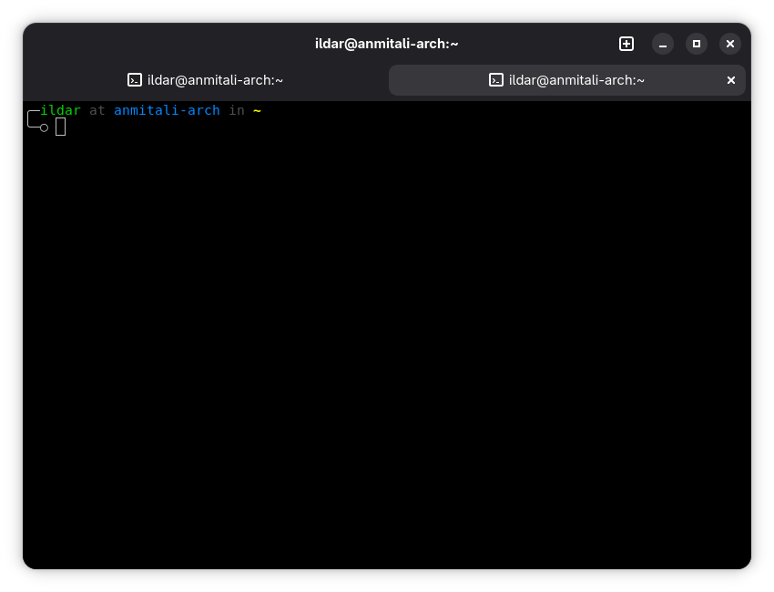

# Aether Command

[](LICENSE)
[](https://github.com/NurOS-Linux/command/releases)
[](https://github.com/NurOS-Linux/command/actions)
[](https://gtk.org/)
[](https://gnome.pages.gitlab.gnome.org/libadwaita/)

A modern, clean terminal emulator built with Vala, GTK4 and LibAdwaita. Originally designed for AetherDE desktop environment, but works on any Linux distribution with GTK4 support.



## Features

- Clean and intuitive GNOME-integrated interface
- Dynamic window title showing current command or prompt
- Full VTE terminal emulation support
- Lightweight and fast
- Native LibAdwaita design

## Requirements

- GTK4 >= 4.0
- LibAdwaita >= 1.0
- VTE >= 0.70 (vte-2.91-gtk4)
- Vala >= 0.56
- Meson >= 0.60
- Ninja

## Installing Dependencies

### Arch Linux

```bash
sudo pacman -S gtk4 libadwaita vte4 vala meson ninja git
```

### Fedora

```bash
sudo dnf install gtk4-devel libadwaita-devel vte291-gtk4-devel vala meson ninja-build git
```

### Ubuntu / Debian

```bash
sudo apt install libgtk-4-dev libadwaita-1-dev libvte-2.91-gtk4-dev valac meson ninja-build git
```

### openSUSE

```bash
sudo zypper install gtk4-devel libadwaita-devel vte-devel vala meson ninja git
```

### Gentoo

```bash
sudo emerge --ask x11-libs/gtk+:4 gui-libs/libadwaita x11-libs/vte dev-lang/vala dev-build/meson dev-build/ninja
```

### Alpine Linux

```bash
sudo apk add gtk4.0-dev libadwaita-dev vte3-dev vala meson ninja git
```

### Void Linux

```bash
sudo xbps-install -S gtk4-devel libadwaita-devel vte3-gtk4-devel vala meson ninja git
```

## Building from Source

### Clone the repository

```bash
git clone https://github.com/NurOS-Linux/command.git
cd command
```

### Build

```bash
meson setup builddir
ninja -C builddir
```

### Run without installing

```bash
./builddir/aether-command
```

## Installation

### System-wide installation

```bash
sudo ninja -C builddir install
```

### Uninstall

```bash
sudo ninja -C builddir uninstall
```

## Usage

Launch from your application menu or run from terminal:

```bash
aether-command
```

The window title will automatically update to show:
- Your shell prompt (e.g., `user@hostname: ~`)
- Running program names (e.g., `vim`, `htop`, `nano`)
- Current working directory

## Development

### Project Structure

```
aether-command/
├── src/
│   ├── main.vala       # Application entry point
│   ├── window.vala     # Main window implementation
│   └── terminal.vala   # VTE terminal widget wrapper
├── data/
│   ├── window.ui                       # GTK UI template
│   ├── org.aether.command.desktop.in   # Desktop entry
│   └── org.aether.command.metainfo.xml.in # AppStream metadata
├── img/
│   └── screenshot.png  # Application screenshot
├── meson.build         # Build configuration
└── LICENSE             # GPL-3.0 license text
```

### Code Style

This project follows standard Vala coding conventions:
- 4 spaces for indentation
- Snake_case for methods and variables
- PascalCase for classes and namespaces

### Contributing

Contributions are welcome! Please see [CONTRIBUTING.md](CONTRIBUTING.md) for detailed guidelines on how to contribute to the project.

## Technical Details

- **Language**: Vala (compiles to C)
- **GUI Toolkit**: GTK4
- **Design System**: LibAdwaita
- **Terminal Backend**: VTE (Virtual Terminal Emulator)
- **Build System**: Meson + Ninja
- **Application ID**: org.aether.command

## License

This project is licensed under the GNU General Public License v3.0 - see the [LICENSE](LICENSE) file for details.

Copyright (C) 2026 NurOS

## Developer

AnmiTaliDev <anmitali198@gmail.com>

## Links

- [GitHub Repository](https://github.com/NurOS-Linux/command)
- [Report Issues](https://github.com/NurOS-Linux/command/issues)
- [NurOS Linux](https://nuros.org)
- [AetherDE Desktop Environment](https://github.com/NurOS-Linux/AetherDE)
- [VTE Documentation](https://gnome.pages.gitlab.gnome.org/vte/)
- [LibAdwaita Documentation](https://gnome.pages.gitlab.gnome.org/libadwaita/)
